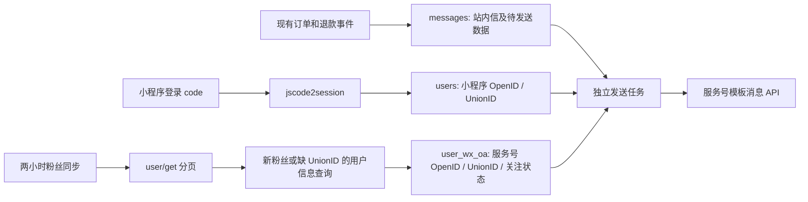

# 小程序依托微信服务号推送消息方案（定时同步，无服务号回调）

日期：2026-09-17。代码基线：`nest` 当前工作区，HEAD `a6c2044`；同时检查了 `fctl` 小程序和 `admin` 管理端。本文是待实施方案，本次未修改业务代码、数据库或微信后台配置。

## 1. 结论与首版范围

按“每两小时同步服务号粉丝、保存身份关联、发送时查询”的方向设计是合理的。但直接调用服务号模板消息接口时，需要的是 **服务号 OpenID**，现有业务保存的是 **小程序 OpenID**，两者不能直接互换。推荐通过同一微信开放平台账号下的 UnionID 关联。

首版推荐：**现有站内信作为记录层，服务号模板消息作为触达层；每两小时同步粉丝，另设发送任务；不接关注、取消关注和模板发送结果回调。** 微信支付/退款回调继续保持现有实现，此处“不接回调”只针对服务号。

首版限定为当前已经触发的订单、退款六类系统通知，服务号卡片统一跳已发布的小程序首页。满足微信侧权限和身份关联条件后，这个范围可以只改后端。若要求直达订单详情、增加关注引导，或让管理端任意手动通知也推到微信，则有额外的小程序/管理端工作，详见第 8 节。

这里的可行性是设计判断，尚未完成真实服务号联调。微信服务端官方文档正文在本次检索中无法访问，不能把当前接口权限、限额和规则写成已核实事实。下文明确区分代码证据、接口基线与实施前核对项；官方入口及检索情况见[研究记录](/Users/lufy/Desktop/ff/nest/docs/wechat-official-account-api-research.md)。

## 2. 现有代码与可以复用的位置

| 位置 | 已有行为 | 本次方案的影响 |
| --- | --- | --- |
| [user.controller.ts](/Users/lufy/Desktop/ff/nest/src/modules/user/user.controller.ts:26) | `/users/wx-login` 调 `jscode2session`，只读取 `openid`；响应为 `{token, admin}` | 后端接收并保存微信返回的 `unionid`，保留前端请求与响应契约 |
| [user.entity.ts](/Users/lufy/Desktop/ff/nest/src/entities/user.entity.ts:4)、[user.repository.ts](/Users/lufy/Desktop/ff/nest/src/repositories/user.repository.ts:15) | `users.wechatOpenId` 唯一；没有 UnionID；已有用户登录后不更新身份字段 | 加 nullable UnionID，登录时对新老用户都做补充更新 |
| [message.service.ts](/Users/lufy/Desktop/ff/nest/src/modules/message/message.service.ts:84) | `send()` 已统一渲染、去重、插入站内信，再调用 `trySendOa()` | 保留业务调用方式，在消息插入时保存服务号待发送数据 |
| [message.service.ts](/Users/lufy/Desktop/ff/nest/src/modules/message/message.service.ts:332) | `trySendOa()` 只有占位日志，`OA_ENABLED=true` 也不会推送 | 实现通道与后台消费；当前不能仅打开开关就上线 |
| [message.entity.ts](/Users/lufy/Desktop/ff/nest/src/entities/message.entity.ts:50) | 已有 `oaSendStatus / oaAttempts / oaLastError`；`SENT=1` 注释为“已送达” | 复用数字值，将 `SENT` 语义改为“微信接口已受理”，补发送控制字段 |
| [message.repository.ts](/Users/lufy/Desktop/ff/nest/src/repositories/message.repository.ts:67) | `createOnce()` 返回 `{message, created}`，唯一键防并发重复 | 待发送数据与站内信一次插入；重复业务事件不另建服务号投递 |
| [app.module.ts](/Users/lufy/Desktop/ff/nest/src/app.module.ts:38) | SQLite；生产 `synchronize=false`；已启用 Nest Schedule；实体显式注册 | 新表、新列需要生产 SQL 和实体注册；可直接用现有调度能力 |
| [transaction-runner.ts](/Users/lufy/Desktop/ff/nest/src/common/transaction-runner.ts:1) | 单连接 SQLite 的事务和写入必须串行 | 所有新增写库复用串行器；微信 HTTP 放在事务和写锁之外 |

`messages.userId` 实际保存小程序 OpenID，而 `users.userId` 是登录产生的 UUID。发送查询必须使用 `users.wechatOpenId = messages.userId`，不能误用 `users.userId`。

仓库虽有 Bull 依赖和 `BookingProcessor` 文件，但当前模块没有注册对应队列或处理器，不能据此假设线上已有可复用 Redis。首版使用 SQLite 待发送记录和 Nest 定时任务，不新增队列基础设施。线上实例数量尚未从部署配置确认，实施前必须核对。

## 3. 微信能力与前提

### 3.1 选择哪种消息

| 能力 | 本方案的定位 |
| --- | --- |
| 服务号模板消息 | 推荐研究/联调路径：真实订单、退款事件对应账号可用的业务模板 |
| 客服消息 | 不作为长周期主动提醒主通道；存在用户交互窗口和下发约束，需要另行核实当前规则 |
| 群发消息 | 面向群体内容发布，不适合作为逐单、逐申请的事务通知 |
| 小程序订阅消息、公众号订阅通知 | 是另外的授权与下发机制，不能把“关注服务号”视为获得相应订阅额度 |
| 小程序统一服务消息 `uniformMessage.send` | 值得实施前核对的备选：若当前权限允许以小程序 OpenID 发送关联服务号模板消息，可能简化身份映射；本次没有核实可用性，首版不依赖它 |

上表是方案选择及待验证约束，不代表已经确认该账号具有这些权限。模板消息对照入口：[新版服务号模板消息文档](https://developers.weixin.qq.com/doc/service/api/notify/template/api_sendtemplatemessage.html)、[历史模板消息文档](https://developers.weixin.qq.com/doc/offiaccount/Message_Management/Template_Message_Interface.html)；统一消息备选入口：[统一服务消息](https://developers.weixin.qq.com/miniprogram/dev/OpenApiDoc/mp-message-management/uniform-message/sendUniformMessage.html)。本次均未取得官方正文。

### 3.2 实施前必须通过的微信侧核对

1. 服务号类型、认证状态及后台接口权限满足用户列表、用户信息、模板消息调用要求。
2. 服务号和小程序绑定同一微信开放平台账号，且真实登录和粉丝信息响应能够拿到可匹配的 UnionID。**同主体、公众号关联小程序、同一开放平台绑定是不同事项，不能互相代替。**
3. 服务号具备适合订单/退款场景的模板 ID；逐个确认模板关键词、类型、长度和下发规则。不要沿用历史文章中的 `first/remark/keyword1` 字段作为通用规范。
4. 如果卡片跳小程序，在服务号后台完成小程序关联，并确认跳转对象是已发布版本。
5. 配置服务号 AppID、AppSecret、出口 IP 白名单；确认同一个服务号的其他系统是否也在获取 access token，并约定统一管理方式。
6. 查看实际接口调用额度和粉丝量，验证两小时同步的请求预算。

没有可匹配 UnionID 时，这条直接发送路径不能自动完成身份关联。不要用姓名、头像、手机号或两个 OpenID 的字符串关系猜测同一用户。

## 4. 身份存储：保留全部粉丝，发送时关联

推荐用两张身份表做关联，不在首版额外维护一份容易过期的“小程序 OpenID → 服务号 OpenID”冗余表。

### 4.1 `users` 增加字段

- `wechatUnionId`：nullable varchar；当前单小程序场景下建唯一索引，缺失时写 `NULL`。另加 `wechatIdentityConflict` integer，默认 0，冲突后置 1 并阻止服务号关联，核对处理后才能恢复。
- 微信返回非空 UnionID 时补充保存；本次响应没返回时保留已有值，不能清空。
- 已有非空值与新值不一致时，记录身份冲突并暂停该用户的服务号自动关联，不能静默覆盖。当前配置绑定到哪个开放平台也应有部署记录。

改动经过 `UserController → UserService → UserRepository`。业务表中的小程序 OpenID 和现有 JWT 载荷不变。微信官方维护的 [API 类型定义](https://raw.githubusercontent.com/wechat-miniprogram/api-typings/refs/heads/master/types/wx/lib.wx.api.d.ts)中，`wx.login` 注释提到服务端换取身份包含 UnionID，并注明小程序绑定开放平台这一条件；该代码证据支持采集可空 UnionID，但不足以替代对服务端完整下发条件和真实响应的核对。

现有库没有保存历史 UnionID，因此上线后需通过用户后续访问首页、重新走微信登录逐步补齐。不能仅靠数据库里旧 OpenID 完成本地回填；旧 JWT 中也没有 UnionID。覆盖率要按“已保存 UnionID 的小程序用户”统计，不能承诺上线时全量用户都可推。

### 4.2 新表 `user_wx_oa`

| 字段 | 用途 |
| --- | --- |
| `id` | 自增主键 |
| `oaAppId`、`oaOpenId` | 服务号身份；组合唯一 |
| `unionId` nullable、`identityConflict` integer 默认 0 | 与小程序用户关联；`(oaAppId, unionId)` 建唯一索引，冲突记录并暂停相关身份，不自动改绑 |
| `subscribed` integer | 最近一次观测的关注状态，0/1 |
| `subscriptionObservedAt` integer | 状态观测时间，用于避免旧同步结果覆盖新发送失败结果 |
| `lastSeenRunId` | 完整扫描中的最后出现批次 |
| `lastInfoAt`、`nextInfoRetryAt` nullable integer | 用户信息查询时间、缺 UnionID 的再次查询时间 |
| `createdAt`、`updatedAt` integer | 遵循现有毫秒时间戳惯例 |

保存所有粉丝，包括暂时没登录过小程序的粉丝。否则“先关注服务号、后登录小程序”的用户还要额外等一次粉丝扫描才能建立关联。

发送查询：`messages.userId → users.wechatOpenId → users.wechatUnionId → user_wx_oa.unionId`，同时限定 `oaAppId`、`subscribed=1` 和两侧身份冲突标记均为 0。同一开放平台 UnionID 只作为跨应用关联键，不取代现有订单归属校验。

### 4.3 同步批次表 `wx_oa_sync_runs`

记录 `runId / oaAppId / startedAt / completedAt / status / lastCursor / seenCount / infoSuccessCount / infoFailureCount / lastError`。用途是区分完整扫描与半途失败，并保留同步新鲜度；不用业务消息表承担同步任务状态。

## 5. 每两小时粉丝同步

接口设计基线为 `GET /cgi-bin/user/get` 分页取服务号 OpenID，`POST /cgi-bin/user/info/batchget` 补 UnionID。常见文档约定分别为单页最多 10,000 个、信息批量最多 100 个；**这些数值本次未从当前官方正文复核，实现时必须核对并做可配置的分批上限。** 对照入口：[用户列表](https://developers.weixin.qq.com/doc/offiaccount/User_Management/Getting_a_User_List.html)、[用户基本信息与 UnionID](https://developers.weixin.qq.com/doc/offiaccount/User_Management/Get_users_basic_information_UnionID.html)。

调度时间：上海时区每个偶数小时的第 43 分钟，如 00:43、02:43、04:43，避开现有任务集中执行的 :10 附近。Nest 六位 cron 表达式为 `0 43 */2 * * *`，指定 `timeZone: 'Asia/Shanghai'`。首次上线在开推送前执行一次完整同步；平时从空游标重新扫全量列表，不能把上轮末尾游标当作下一轮的增量起点，否则无法发现取消关注。

每轮处理：

1. 获得任务锁，创建 `RUNNING` 批次；没有凭据或通道关闭时不调用微信。
2. 分页请求列表，校验返回错误、分页终止条件和重复游标。粉丝列表只提供服务号身份，仍需用户信息查询才能补 UnionID。
3. 把本页 OpenID 分批写入/更新 `lastSeenRunId` 与关注观测，网络请求不占 SQLite 写锁。
4. 用户信息主要查新增粉丝和到期仍缺 UnionID 的粉丝；已有可靠 UnionID 不必每两小时全量查询。缺 UnionID 当作可恢复状态，逐步退避重查，响应缺字段不清空已保存值。
5. **只有列表所有页成功、全部列表标记写入成功后**，才能把本轮未出现的历史粉丝标为未关注。列表半途失败时保留原关注状态，禁止“没扫到就批量退订”。
6. 用户信息单批失败可单独记录，列表仍可完成关注对账；涉及该批的身份关联保持缺失，下次重试。区分“列表完整”与“身份信息全部补齐”。
7. 更新成功时间、耗时和数量，释放任务锁。连续失败或明显超过一个同步周期时告警。

完整分页不是微信侧的原子快照。扫描期间关注/退订的变化可能到下一轮才反映；归一化完成时还要比较观测时间，避免覆盖本轮开始后产生的“发送接口明确返回未关注”状态。不承诺精确两小时内总能发现变化，正常成功运行下约为一个同步周期加扫描耗时。

调用预算按真实额度评估：若粉丝量为 F，以 10,000/页和 100/批基线估算，每天 12 轮列表约 `12 × max(1, ceil(F/10000))` 次，另加可能的结束确认、重试请求；首次信息补齐约 `ceil(F/100)` 次，之后按新增及缺 UnionID 重查量计算。如果每轮全量补信息，则单信息接口约 `12 × ceil(F/100)` 次/日，通常没有必要。额度不足时先降低信息重查频率，而不是频繁刷新 token。

## 6. 发送与失败处理

### 6.1 消息落库即保留待发送记录

不把微信 HTTP 调用放在下单、审核或微信支付回调的同步链路中。由 `MessageService.send()` 生成站内信，同时生成服务号结构化数据，交给 `createOnce()` **一次插入** `messages`；后台任务再消费。这样消息落库后进程重启，待发送内容仍在。

现有 `trySendOa()` 可以改为仅唤醒后台消费的轻量入口；定时扫描必须独立存在，不能只靠 `created=true` 时调用一次。现有去重返回分支继续保留，避免同一业务事件产生重复投递。

服务号正文不能从 `messages.title/content` 反向解析。当前消息上下文含订单号、申请单号、退款金额等，应在生成消息时渲染模板字段并保存 `oaPayloadJson`，包含模板 ID、版本、关键词值、小程序跳转参数，不含 token。比如退款到账金额由申请单快照的“分”转换，不能事后用正则解析正文里的金额。

`OA_ENABLED=false`、消息类型没有已配置模板时直接 `SKIPPED`，不影响站内信成功语义。`SendResult.sent` 继续表示站内信已落库，不改为服务号送达结果；订单的 `expireNotifiedAt` 等业务标记也继续沿用现有语义。

### 6.2 补充发送台账

在现有三个 OA 字段上增加：`oaPayloadJson / oaNextAttemptAt / oaExpiresAt / oaMsgId / oaSkipReason / oaClaimedAt`。除 JSON、原因、msgid 外，其余采用现有 integer 毫秒时间戳规范；按 `(oaSendStatus, oaNextAttemptAt, id)` 建待发送索引。

保留原数字 0–3，增加状态：

| 状态 | 语义 |
| --- | --- |
| `PENDING=0` | 等待发送、等待身份补齐，或明确可重试错误 |
| `SENT=1` | 微信发送接口返回成功受理；保存 `msgid`。不能解释为已送达/已阅读 |
| `FAILED=2` | 明确永久错误或已用尽可重试次数 |
| `SKIPPED=3` | 通道关闭、未配置模板、未关注、通知已经过期等；保存具体原因 |
| `SENDING=4` | 已领取，正在调用发送接口 |
| `UNKNOWN=5` | 请求可能被微信受理，但本地没有确定结果；保留供人工排查 |

发送任务每分钟运行一次，按到期时间和 ID 分批领取，初始建议每批 20 条、HTTP 并发 2；用条件更新 `PENDING → SENDING` 领取，不能只有先 SELECT 后 UPDATE。`oaAttempts` 仅在真正尝试发送 HTTP 时增加，等待关联不消耗次数。

首版要求同一数据库只有一个服务号调度执行者；进程内加重入保护。多实例部署时需要数据库租约/指定 worker，并保证 token 管理一致，单个布尔值不能防跨进程重入。

### 6.3 具体策略

| 情况 | 行为 |
| --- | --- |
| 小程序 UnionID 或粉丝关联尚未补齐；还没有完整同步 | 保持 `PENDING`，10 分钟后再检查，到消息有效期后跳过；不把“暂时查不到”永久判为未关注 |
| 已知服务号身份，但最近状态为未关注 | `SKIPPED: NOT_SUBSCRIBED`；后续重新关注仅恢复未来投递，不重放旧消息 |
| 发送接口明确返回未关注 | 将该粉丝状态记为未关注并记录观测时间，该消息跳过；不盲目重试 |
| 明确的 token 失效 | 让统一 token 管理模块刷新并重发一次；禁止每个业务请求各自刷新 |
| 明确未受理的系统繁忙等可重试响应 | 1 分钟、5 分钟退避，最多三次实际发送，且不超过有效期；错误分类需按当前官方定义核对 |
| 权限、模板 ID、字段类型、长度、目标身份错误 | 终止或暂停受影响通道并告警；不能靠重试修复配置问题，也不能一概标成用户退订 |
| HTTP 超时、断连、异常网关响应、进程在领取后崩溃 | 转 `UNKNOWN`，默认不自动重发；发送结果可能不确定，自动重发可能重复通知 |
| 成功返回 `errcode=0` 与 `msgid`，但本地状态写回失败 | 仅重试本地状态写回；恢复后仍无法确认时归 `UNKNOWN`，不能重新发一遍微信消息 |

过期 `SENDING` 在进程恢复后转 `UNKNOWN`，不直接回收成 `PENDING`。没有服务号发送结果回调时，只掌握同步 API 结果，无法证明最终到达、被读，也无法对超时实现严格“恰好一次”。本方案选择减少重复通知，站内信继续提供可查询记录。

消息有效期建议：即将过期提醒截至上海时区当天结束；订单已过期可退款通知截至该单申请截止日，无截止日信息时默认首次生成后 24 小时；退款受理/审核结果/到账通知首次生成后 24 小时。有效期由结构化上下文生成，不解析站内信正文。身份缺失的消息仅在上述范围内尝试关联。首版不补发开通道前历史 `SKIPPED` 消息，避免集中推送过时状态。

## 7. 模板、token 和模块边界

首版模板映射覆盖 `ORDER_EXPIRE_REMINDER / ORDER_EXPIRED / REFUND_ACCEPTED / REFUND_APPROVED / REFUND_REJECTED / REFUND_SUCCESS`。不同事件可复用账号确实提供的同一业务模板，但字段必须符合场景；某类没有合适模板就保持站内信。`FEEDBACK_REPLIED` 当前只有枚举和模板占位，没有已接通的反馈通知调用，不把它算作此次后端通道自动拥有的新功能。

建议新增 `WechatOaModule`，内部负责 `WechatOaClient / WechatOaTokenService / WechatOaFanSyncService` 及粉丝、同步批次 Repository；不导入 Booking/Refund/Feedback/Message 等业务模块。`MessageModule` 单向导入 OA 模块，自己的发送 worker 读消息台账并调用 OA client。UserModule 只保存登录 UnionID，避免反向依赖 OA 模块造成循环。

配置：复用 `OA_ENABLED`，新增 `OA_APPID / OA_SECRET` 与每个启用消息类型的模板配置；小程序 AppID 继续使用 `WX_APPID`。启动时校验已启用项的模板配置，缺失项明确跳过并告警，不能静默积压。

服务号 token 与小程序 token、微信支付证书是不同凭据。按获取响应中的 `expires_in` 缓存并提前刷新，同一时刻只允许一个刷新操作。实施时核对普通 token 与 `stable_token` 的当前适用规则，再统一选择；本方案不硬编码“固定两小时有效”或“每天固定额度”。其他系统使用同一服务号时先协调 token 来源。

新增 UnionID 必须纳入[日志敏感字段过滤](/Users/lufy/Desktop/ff/nest/src/modules/logging/sensitive-filter.ts:23)；现有过滤包含 OpenID，却不包含 UnionID。仅保存脱敏错误码和可诊断摘要，不记录带 secret/token 的完整请求 URL 或未经清理的 Axios 错误对象。发送相关新列继续不下发小程序用户端，现有消息控制器已有白名单转换。

## 8. “纯后端改动”的实际边界

小程序当前只在[首页 onLoad](/Users/lufy/Desktop/ff/fctl/pages/index/index.vue:239) 调微信登录，[App.vue](/Users/lufy/Desktop/ff/fctl/App.vue:3) 没有全局登录初始化。[订单详情 onLoad](/Users/lufy/Desktop/ff/fctl/pages/booking-detail/booking-detail.vue:543) 直接请求需要 JWT 的订单接口；请求层没有登录恢复机制。

- **首版只改后端**：服务号卡片统一跳 `pages/index/index`，用户完成已有首页登录后，从订单/消息中心继续查看。后台通过原登录请求补 UnionID，无需新增前端身份参数或订阅弹窗；首页等待身份同步不应影响正常登录。
- **卡片直达订单详情**：后端可以构造已有路径并去掉前导 `/`，但还需小程序统一登录 Promise、token 失效恢复、目标页等待登录再加载；当前冷启动/过期 JWT 场景不能保证可用。
- **增加关注二维码、绑定状态、“刚关注立即能推”提示**：需要小程序 UI 和必要的状态查询接口，不属于首版。
- **任意管理员手动通知同时推微信**：当前 `sendAdminNotice()` 没有调用 OA 占位入口，`AdminService` 只记录 `sendOa` 请求并固定返回 `oaSent=false`。管理端又写死了“通道未上线”等说明。若扩展此场景，必须设计合规的结构化业务模板、接入请求意图，并修正排队/受理提示；不能直接把 500 字自由文本塞进模板。异步入队后也不能立刻回 `oaSent=true`。见[后端手动入口](/Users/lufy/Desktop/ff/nest/src/modules/admin/admin.service.ts:220)和[管理端提示](/Users/lufy/Desktop/ff/admin/src/pages/messages/index.tsx:113)。

因此，“纯后端”可以成立，但需要采用上面的首版范围，并且仍然有微信后台配置工作。

## 9. 实施顺序与验收

1. 用测试微信账号核对第 3 节前提，拿到同一人的小程序登录与粉丝信息响应，确认 UnionID 真能匹配；同时检查统一服务消息备选是否仍可用。前提未通过时先解决权限/绑定，不用假关联推进发送。
2. 增加 users UnionID、新粉丝表及同步批次表；准备独立生产 SQL，按现有 SQLite 生产关闭 synchronize 的方式部署并验证索引。
3. 接入登录 UnionID 保存、token 管理、两小时同步；保持推送关闭，跑一次完整同步，观察粉丝总量、匹配率、缺 UnionID 量和实际 API 消耗。
4. 增加消息结构化快照、状态字段及后台发送任务；复用既有业务触发和去重，不改变订单/退款状态机。
5. 完成测试账号的六类场景联调后，再开启推送；上线时不把此前历史消息批量回填为待发送。

验收至少覆盖：

- 同一测试用户的两种 OpenID 不同、UnionID 相同，实际消息发给正确服务号身份；身份冲突不串号。
- 老用户再次登录补 UnionID；登录响应缺 UnionID 不清空旧值；UnionID 缺失不影响原登录和订单功能。
- 先关注后登录、先登录后关注、新关注尚未同步、取消关注后发送、重新关注等场景符合等待/跳过策略。
- 多页列表完整扫描、0 粉丝、重复游标、列表半途失败、信息单批失败；部分扫描不把其余用户全部标成退订。
- 消息已插入后进程重启仍可消费；同一业务去重键不重复插入；同一订单不同退款申请仍各自产生消息。
- token 刷新重入、永久错误、明确可重试错误、结果不确定、成功后本地写回失败；不能把不确定请求盲目重发。
- OA 通道关闭和微信接口故障不影响站内信、退款状态及支付回调响应；新增同步写入与现有 SQLite 写入兼容。
- 服务号卡片实际跳到已发布首页，完成当前登录并能查看站内信；后台台账显示“受理”，不声称用户已收到。

本次仅完成代码阅读和方案整理，以上联调、测试与 SQL 均为后续实施项，尚未执行。
